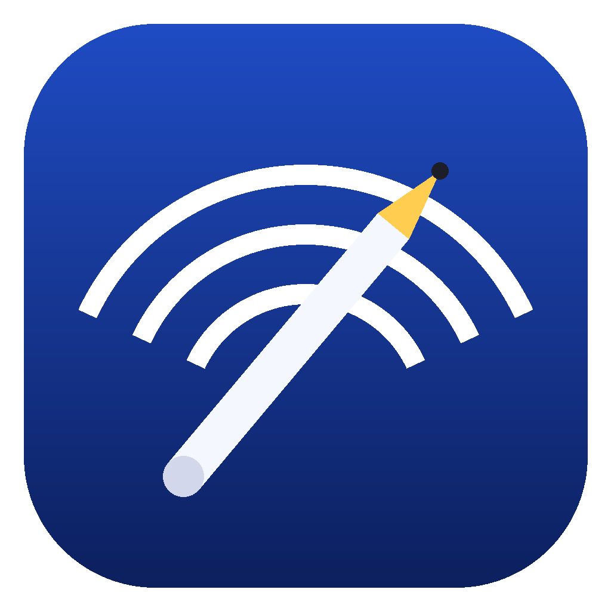

<div align="center">



# PenBridge

**iPad + Apple Pencil을 Windows용 펜 태블릿으로 만들어주는 프로그램**

[-0078D6?logo=windows&logoColor=white)](#요구-사항)
[](#요구-사항)
[](#)
[](LICENSE.txt)

[Windows 설치 파일](https://github.com/tharu8813/PenBridge/releases/latest) · [iPad 웹 클라이언트](https://tharu8813.github.io/PenBridge/)

</div>

---

앱 설치 없이, iPad Safari로 접속만 하면 Apple Pencil의 위치·필압·기울기가 그대로
Windows의 펜 입력으로 전달됩니다. 그림판, 포토샵, 클립스튜디오 등 펜 입력을 지원하는
모든 프로그램에서 바로 사용할 수 있습니다.

## 시작하기

1. **PenBridge.exe**를 더블클릭해서 실행합니다. (관리자 권한 필요 없음)
2. 창에서 **서버 시작** 버튼을 누릅니다.
3. iPad Safari에서 **[PenBridge 웹 클라이언트](https://tharu8813.github.io/PenBridge/)**를 엽니다.
4. PC 창의 주소를 입력하거나 웹사이트의 **QR 코드 스캔**으로 QR을 비춥니다.
5. 연결된 작업 화면의 **설정**에서 원하는 모니터·화면 맞춤을 고른 뒤 필기를 시작합니다.

> PC와 iPad는 **같은 Wi-Fi(같은 공유기)** 에 연결되어 있어야 합니다.

접속이 안 되면 아래 [문제 해결](#문제-해결)을 확인하세요.

## 요구 사항

| | |
|---|---|
| **PC** | Windows 10(버전 1809 이상) 또는 Windows 11, 64비트 |
| **iPad** | Safari, Apple Pencil (1세대 · 2세대 · Pro 모두 지원) |
| **네트워크** | PC와 iPad가 같은 Wi-Fi/LAN에 연결 |

## 문제 해결

| 증상 | 확인할 것 |
|---|---|
| iPad에서 접속이 안 됨 | PC와 iPad가 같은 Wi-Fi인지, PenBridge가 "서버 시작" 상태인지 확인 |
| QR 스캔 후 페이지가 안 열림 | Safari 카메라 권한과 QR 주소가 실제 PC의 Wi-Fi IP인지 확인 |
| 공용 작업 화면을 불러오지 못함 | 웹사이트의 `dist` 폴더가 함께 배포됐는지 확인 |
| 포트 충돌 | 다른 프로그램이 같은 포트를 쓰면 자동으로 다음 포트를 시도합니다 |
| 방화벽 경고가 뜸 | Windows Defender 방화벽에서 "개인 네트워크" 통신을 허용하세요 |
| Apple Pencil이 인식 안 됨 | 손가락/마우스 입력은 기본적으로 무시됩니다 |
| 연결이 자주 끊김 | Wi-Fi 신호를 확인하세요. 화면 잠금/앱 전환 후에는 자동으로 재연결을 시도합니다 |
| Windows 버전 오류 메시지 | Windows 10 버전 1809 이상이 필요합니다 (Windows 11 권장) |

## 안전하게 사용하기

- **집·개인 Wi-Fi 등 신뢰할 수 있는 네트워크에서만 사용하세요.** 공용 네트워크나 인터넷에
  직접 노출하는 용도로는 만들어지지 않았습니다.
- 암호나 페어링 코드는 사용하지 않습니다. PC와 같은 신뢰할 수 있는 Wi-Fi에서만 서버를 시작하세요.
- 한 번에 하나의 iPad만 연결할 수 있습니다.
- 좌표·필압 등 입력 데이터는 PC와 iPad 사이에서만 오가며, 외부 서버로 전송되지 않습니다.

## 개발자 정보

<details>
<summary>프로젝트 구조 및 빌드 방법 보기</summary>

```
PenBridge.slnx      # Windows 앱 + 테스트 솔루션 (Visual Studio에서 이 파일을 여세요)
PenBridge/           # Windows 프로그램 (.NET, 펜 입력 주입)
PenBridge.Tests/     # 단위 테스트 (.NET) + Node.js 클라이언트 회귀 테스트
PenBridge.Web/       # iPad용 웹 클라이언트 (정적 파일, GitHub Pages 배포용)
```

`PenBridge.Web`은 `.csproj`가 없는 정적 웹 폴더라 솔루션에 포함되지 않으며, Visual Studio
솔루션 탐색기에 나타나지 않는 것이 정상입니다.

```bash
# 솔루션 전체 빌드
dotnet build PenBridge.slnx

# 개발 실행
dotnet run --project PenBridge

# 단위 테스트
dotnet test PenBridge.Tests -c Release

# iPad 클라이언트 회귀 테스트 (Node.js)
node --test PenBridge.Tests/client-input.test.cjs

# 배포용 단일 실행 파일 빌드
dotnet publish PenBridge -c Release -r win-x64 --self-contained true -p:PublishSingleFile=true -o PenBridge/publish

# 웹 클라이언트 빌드 (PenBridge.Web/dist 생성, 이 폴더만 GitHub Pages 등에 배포)
cd PenBridge.Web && node build.cjs
```

</details>

## 라이선스

[GNU GPLv3](LICENSE.txt)
